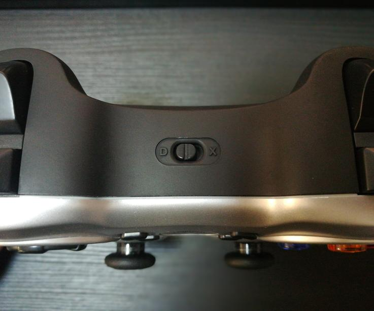
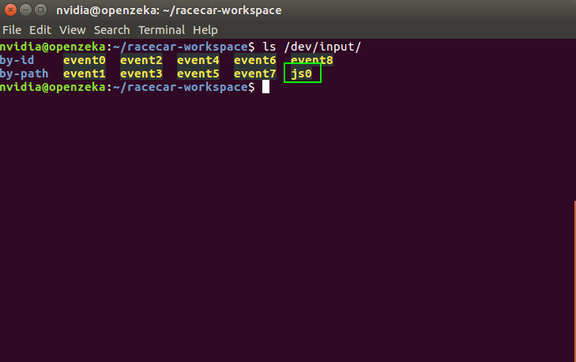
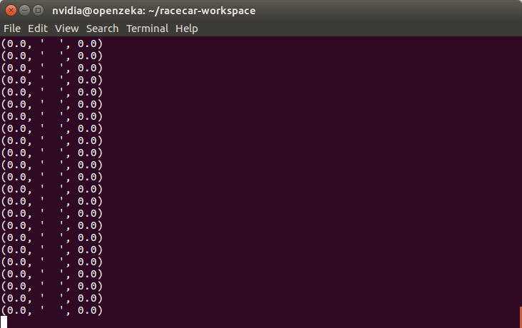
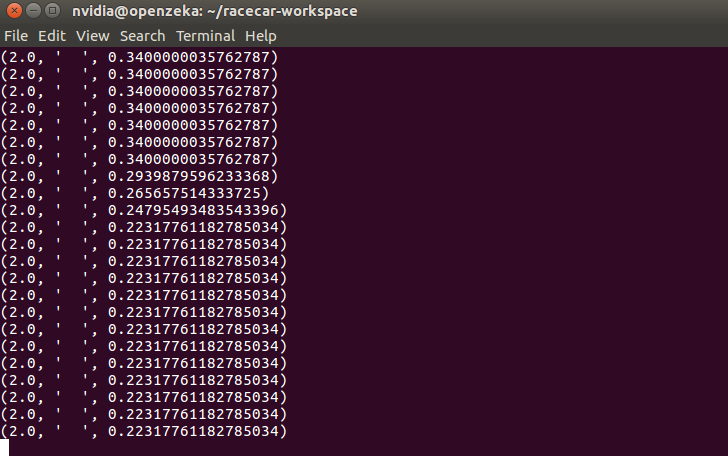

# Jetson'a JetPack kurduktan sonra izlenecek ilk adımlar
### Jetson ın IP adresini al ve ssh ile bağlan
MacOS'de "lanscan", Windows'da "wnetwatcher", ve Linux'de "angry ip scanner" kullanabilirsin. Veya terminal i kullanarak IP tarayabilirsin:

```bash
sudo apt-get update && sudo apt-get install arp-scan
sudo arp-scan --localnet ## Burada "--interface" seçeneğini araştırman gerekebilir
```
Çıktı buna benzemeli:
```bash
Interface: enp0s5, datalink type: EN10MB (Ethernet)
Starting arp-scan 1.8.1 with 256 hosts (http://www.nta-monitor.com/tools/arp-scan/)
192.168.1.110	XX:XX:XX:XX:XX:XX	NVIDIA

2 packets received by filter, 0 packets dropped by kernel
Ending arp-scan 1.8.1: 256 hosts scanned in 1.546 seconds (165.59 hosts/sec). 2 responded
```
IP yi öğrendikten sonra:
```bash
ssh nvidia@<buraya IP adresi>
# örnek:
ssh nvidia@192.168.1.110 # varsayılan şifre: nvidia
```

### Şifreyi değiştir
Şifreyi varsayılan olarak bırakmak iyi bir fikir değildir
```bash
passwd
```

### Text editör ü kur (özellikle yeni linux kullanıcısı isen nano kullan)
```bash
sudo apt-get install nano
```

---
### Hostname i (bilgisayar ismini) değiştir
Her seferinde IP adresini aramak yerine yerel domain kullanmak için.  
[Ascii Cinema sürümü (video gibi ama yazıları kopyalayabilirsin)](https://asciinema.org/a/nytXz7ZUMGAXb6VpHY0fLHEJY)
```bash
sudo apt-get update && sudo apt-get upgrade
sudo apt-get install avahi-daemon
```
`/etc/hosts` dosyasına girip:
```bash
sudo nano /etc/hosts
```
Şu satırı bul ve `tegra` yı istediğin isimle değiştir, mesela takımının adını yazabilirsin:
```bash
...

127.0.1.1       tegra
...
```
Aynı ismi bu dosyaya da yaz:
```bash
sudo nano /etc/hostname
```
Son olarak `hostname` script ini çalıştır ve yeniden başlat:
```bash
sudo /etc/init.d/hostname.sh

sudo reboot
```
---

Şimdi hostname i kullanarak giriş yapabilirsin:
```bash
ssh nvidia@<Buraya hostname>.local
# örnek:
ssh nvidia@teamName.local
```

### zsh'i kur (isteğe bağlı)
Ascii cinema: https://asciinema.org/a/x6QlETqxDvdK8t0lmBvOWVoKD

### screen'i kur
Screen, linux terminal'inde program çalıştırırken işe yarayacak, bağlantı kopsa bile arkaplanda istediğimiz script i çalıştırmaya devam etmek için kullanacağımız bir program.
```bash
sudo apt-get install screen
```
Screen kullanımını öğrenmek için:  
https://www.gnu.org/software/screen/manual/screen.html


Devam etmeden önce bazı gerekli uygulamaların kurulması gereklidir. Bunun için terminalde şu kodu çalıştırabilirsiniz. 
```bash
sudo apt-get install cmake ca-certificates
```

## Kerneli yeniden derle
Bu işlem için JetsonHacks tarafından hazırlanan döküman da takip edilebilir. 
Kerneli derlemek için öncelikle gerekli dosyaları şuradan çekin
```bash
cd ~/
git clone https://github.com/jetsonhacks/buildJetsonTX2Kernel.git
```
Dosyaları Jetsona kaydettikten sonra ilk olarak kernel dosyalarını NVIDIA'nın sitesinden çekelim. Bunun için aşağıdaki komutu çalıştırın
```bash
cd ~/buildJetsonTX2Kernel
#Getting the kernel sources
./getKernelSources.sh
```
İşlem tamamlandıktan sonra .config dosyasındaki düzenlemeler için bir grafik arayüzü açılacaktır. 
Burada bazı değişiklikler yapmamız gerekmektedir. JetsonHacks'e ait olan [bu videodan](https://www.youtube.com/watch?v=fxWObd1nK4s) da takip edebilirsiniz. 

Öncelikle açılan ekrandan **General Setup**'a tıklayın. sağ tarafta açılan menüden **Local version -append to kernel release** çift tıklayın. Bu kısma - ile başlayan bir isim girebilirsiniz. Biz *-openzeka-v0.1* yazıp devam edeceğiz. 

Daha sonra **Edit > Find** seçeneğinden açılan pencereye **ACM** yazarak **USB Modem (CDC ACM) support**'u aktif hale getirin.Nokta ile değil tik işareti ile işaretlediğinizden emin olunuz. 

Daha sonra aynı şekile aratarak **CH341** Portunu da aktifleştirin.

Değişiklikleri kaydederek kapatın. Artık kerneli derleyebiliriz. Aşağıdaki kodu çalıştırın.
```bash
cd ~/buildJetsonTX2Kernel
#Building the kernel sources
./makeKernel.sh
```
Bu işlem 10 dakika civarında sürmektedir. Derleme tamamlandıktan sonra, derlenen dosyaları kopyalabiliriz. Bunun için şu kodu çalıştırabilirsiniz.
```bash
cd ~/buildJetsonTX2Kernel
#Copying the kernel sources
./copyImage.sh
```
Jetsonu yeniden başlatın

Bu işlemler bittikten sonra indirilen dosyaları silebilirsiniz. Dosyalar /usr/src/sources dizinine indirilmiştir. Silmek için aşağıdaki komutu çalıştırabilirsiniz. 
```bash
cd /usr/src/sources
sudo rm -rf kernel_src-tx2.tbz2 
```

## Scanse SDK sını kur
```bash
cd ~/
# clone the sweep-sdk repository
git clone https://github.com/scanse/sweep-sdk

# enter the libsweep directory
cd sweep-sdk/libsweep

# create and enter a build directory
mkdir -p build
cd build

# build and install the libsweep library
cmake .. -DCMAKE_BUILD_TYPE=Release
cmake --build .
sudo cmake --build . --target install
sudo ldconfig
```
## ROS Kinetic i kur
Racecar ROS (Robot Operating System) kütüphaneleri ile çalışıyor. Bundan daha sonra bahsedeceğiz, şimdi kuralım:  
(Kurulum ile ilgili ayrıntılı ve açıklamalı döküman için: http://wiki.ros.org/kinetic/Installation/Ubuntu . Veya kısaca aşağıdakileri de uygulayabilirsin:)
```bash
sudo sh -c 'echo "deb http://packages.ros.org/ros/ubuntu $(lsb_release -sc) main" > /etc/apt/sources.list.d/ros-latest.list'

sudo apt-key adv --keyserver hkp://ha.pool.sks-keyservers.net:80 --recv-key 421C365BD9FF1F717815A3895523BAEEB01FA116

sudo apt-get update
sudo apt-get install ros-kinetic-desktop-full
# Bu kurulum biraz uzun sürmektedir.
sudo rosdep init
rosdep update
```
Bash kullanıyorsan:
```bash
echo "source /opt/ros/kinetic/setup.bash" >> ~/.bashrc
source ~/.bashrc
```
Zsh kullanıyorsan:
```bash
echo "source /opt/ros/kinetic/setup.zsh" >> ~/.zshrc
source ~/.zshrc
```
Son olarak:
```bash
sudo apt-get install python-rosinstall python-rosinstall-generator python-wstool build-essential
```
## VESC sürücülerini yükle
Youtube da [Bu online tutorial](https://www.youtube.com/watch?v=fiaiA-o83c4) ı takip edeceğiz.  
Bu bölüm için bir ekran a ihtiyacın var, veya X server mevcut olan bir işletim sistemine. X server programlar ve OS arasında bir ara birim olarak görev yapar. X server ı havalı yapan bir özellik de başka bir cihazda çalışan X server işlemine uzaktan bağlanabiliyor olmamız. Bu anlattıklarım çok mantıksız gelmiş veya bir cacık anlamamış olabilirsin :). Eğer öyleyse endişelenme, sadece adımları takip et.

* Bunlardan birini yap:
  * Cihazını (jetson), bir ekran a bağla,   
  veya
  * X server mevcut olan bir işletim sisteminde oturum aç (linux de her zaman vardır, yani senin VM'inde de var. Aynı zamanda Macos'de [xquartz](https://www.xquartz.org/)'ı da kurabilirsin. Windows konusunda hiçbir fikrim yok)  
  Bir ssh oturumu ile bağlan
  ```bash
  ssh user@host -X
  # -X seçeneğine dikkatini çekerim
  ```
  X server ın çalıştığından emin ol:
  ```bash
  nautilus .
  ```
  Eğer kendi ekranında bir pencerenin açıldığını görürsen devam etmek için hazırsın!

Yukarıdaki seçeneklerden herhangi birini yaptıysan [Jetsonhacks'in bu videosu](https://www.youtube.com/watch?v=fiaiA-o83c4) ile devam edebilirsin  
Bununla işin bittiğinde racecar kodunu kurabiliriz!

## <a name="installracecar"></a> Racecar ı kur
Ana dizine racecar kodunu yükleyeceğiz, önce ana dizine gir ve kodu indir:

```bash
cd ~/
git clone --recursive https://github.com/openzeka/racecar-workspace
```
Racecar kodu `src/` klasörünün içinde. Bu `racecar-workspace` klasörü `catkin workspace` adında bir çalışma ortamı. ROS kullanımı ve catkin workspace ile ilgili daha ayrıntılı bilgiye ulaşmak için:  
wiki.ros.org/ROS/Tutorials  
ve eğitimde kullanılan örneklere ulaşmak için:  
github.com/openzeka/racecar-controllers  
Şimdilik devam edelim, kodu sonra inceleyeceğiz.

Şimdi kodu derleyelim:
```bash
cd ~/racecar-ws
rm -rf build devel
catkin_make
```
catkin_make sırasında *ackermann_msgs* hatası alırsanız, aşağıdaki eklentileri kurduktan sonra tekrarr **catkin_make** yapınız. 

```bash
sudo apt-get install ros-kinetic-ackermann-msgs 
sudo apt-get install ros-kinetic-serial
cd ~/racecar-ws
rm -rf build devel
catkin_make
```
Aşağıdaki eklentilerin de kurulu olduğundan emin olunuz.

```bash
sudo apt-get install ros-kinetic-joy
sudo apt-get install ros-kinetic-joy-teleop 
```

ve test edelim:  

---
**bash kullanıyorsan:**
```bash
source devel/setup.bash
```
**zsh kullanıyorsan:**
```bash
source devel/setup.zsh
```

```bash
roslaunch racecar teleop.launch
```

"Portları bulamadım" gibi bir yığın hata göreceksin. Bu hataları düzeltmemiz için port kuralları ayarlamamız gerek. Port konfigürasyonu için devam et..

---

## Usb port kuralları konfigürasyonu
Usb sensörleri, motoru vb taktığımızda linux bunlara ttyUSB0 gibi adresler verir. Bu adresler herkesde aynı olmayabilir, ama sabit olmasını istiyoruz ki daha sonra hangi port a ney bağlı diye bakmakla uğraşmayalım.

Önce usb cihazları bul:
```bash
lsusb
```
Çıktı böyle birşey olacak:
```bash
Bus 002 Device 003: ID 0bda:0411 Realtek Semiconductor Corp.
Bus 002 Device 002: ID 0bda:0411 Realtek Semiconductor Corp.
Bus 002 Device 001: ID 1d6b:0003 Linux Foundation 3.0 root hub
Bus 001 Device 010: ID 0403:6001 Future Technology Devices International, Ltd FT232 USB-Serial (UART) IC
Bus 001 Device 004: ID 045e:0745 Microsoft Corp. Nano Transceiver v1.0 for Bluetooth
Bus 001 Device 009: ID 046d:c21f Logitech, Inc. F710 Wireless Gamepad [XInput Mode]
Bus 001 Device 007: ID 046d:082d Logitech, Inc. HD Pro Webcam C920
Bus 001 Device 006: ID 1b4f:9d0f
Bus 001 Device 005: ID 0483:5740 STMicroelectronics STM32F407
Bus 001 Device 003: ID 0bda:5411 Realtek Semiconductor Corp.
Bus 001 Device 002: ID 0bda:5411 Realtek Semiconductor Corp.
Bus 001 Device 001: ID 1d6b:0002 Linux Foundation 2.0 root hub
```
Scanse Sweep Lidar'ı, vesc'yi ve imu'yu arıyoruz. Bu cihazları filtrele:
```bash
lsusb | grep "9dof\|STMicro\|Future Technology"
```
Çıktı:
```bash
Bus 001 Device 010: ID 0403:6001 Future Technology Devices International, Ltd FT232 USB-Serial (UART) IC
Bus 001 Device 006: ID 1b4f:9d0f
Bus 001 Device 005: ID 0483:5740 STMicroelectronics STM32F407
```
Vendor ID ve/veya Product ID'ye ihtiyacımız var. Neyse ki lsusb aşağıdaki format ile bu iki bilgiyi de veriyor:
```html
Bus <bus number> Device <device number>: ID <vendor id>:<product id> <Device name>
```
Hadi onları alalım.
İlk cihaz `(Future Technology Devices International, Ltd FT232 USB-Serial (UART) IC)` scanse sweep lidar oluyor. İkincisi imu (9d0f göndermesini farkettin mi?). Son olarak(`STMicroelectronics`) de vesc. Mesela vesc'nin vendor ID'si `0483`, and product ID'si `5740`, bazı sayılar senin ürününde farklı olabilir o yüzden kontrol etmen gerek.

Usb port kurallarını ayarlamak için usb kural dosyasını düzenleyeceğiz:
```bash
sudo nano /etc/udev/rules.d/99-usb-serial.rules
```
Böyle göründüğünden emin ol, `idVendor` karşısına "vendor id"lerini, `idProduct` karşısına "product id"lerini yaz
```bash
ATTRS{idVendor}=="0403", SYMLINK+="sweep"
ATTRS{idProduct}=="6015", SYMLINK+="sweep"

ATTRS{idVendor}=="1b4f", SYMLINK+="imu"
ATTRS{idProduct}=="9d0f", SYMLINK+="imu"

ATTRS{idVendor}=="0483", SYMLINK+="vesc"
ATTRS{idProduct}=="5740", SYMLINK+="vesc"
```
**Usb cihazları tekrar çıkar-tak**, ve bağlantıyı test et:
```bash
l /dev/vesc || l /dev/sweep || l /dev/imu
```
Çıktı olarak bu kısayolların görmen gerek:
```powershell (for syntax highlighting)
lrwxrwxrwx 1 root root 7 Nov  9 11:16 /dev/vesc -> ttyACM0
lrwxrwxrwx 1 root root 7 Nov  9 10:59 /dev/sweep -> ttyUSB0
lrwxrwxrwx 1 root root 7 Nov  8 21:29 /dev/imu -> ttyACM1
```


Buraya kadar herşey çalışıyorsa programı incelemeye başlayabiliriz! Örnek ROS dökümanlarımıza ve örnek kodlara bir göz at:  
[ROS temelleri](lecture%20materials/ros%20fundamentals.md)  
[Racecar örnek kodları](https://github.com/openzeka/racecar-controllers/tree/bwsi_2017/marc-examples)

---------------------------------
Ek olarak bu da işe yarayabilir, fakat bu uygulama için ihtiyacımız yok:
```bash
# Cihazların seri numaralarını öğrenmek için:
usb-devices | grep "Manufacturer\|Product\|SerialNumber\|^$"

```

# Projeyi kendi çalışma alanına taşı:
[Projeyi klonladıktan sonra](#installracecar) kendi çalışma alanına taşıyıp takım arkadaşlarınla Git kullanmak istersen (öhm, istemelisin!):

ana dizindeki `.gitmodules` dosyasına gir. Buna benziyor olmalı:
```bash
[submodule "src/racecar"]
	path = src/racecar
	url = https://github.com/openzeka/racecar.git
[submodule "src/racecar-controllers"]
	path = src/racecar-controllers
	url = https://github.com/openzeka/racecar-controllers.git
[submodule "src/racecar-simulator"]
	path = src/racecar-simulator
	url = https://github.com/openzeka/racecar-simulator.git
[submodule "src/vesc"]
	path = src/vesc
	url = https://github.com/mit-racecar/vesc
```
Bu gördüklerine submodule deniyor (Ayrıntı için: [7.11 Git Tools - Submodules](https://git-scm.com/book/en/v2/Git-Tools-Submodules)). Submodule ler sayesinde birden fazla git projesini bir proje altında toplayabiliyoruz, burada da öyle yaptık. Fakat muhtemelen değişiklik yaptığında commit ve push dediğin zaman iznin olmadığını söyleyecek, bunun için kendi özel repository ni oluşturmalısın.  
* Github da her proje için (racecar, racecar-controllers, racecar-simulator, vesc) bir repository oluştur ( - Nasıl yapılıyodu unuttum!: [Github: Create A Repo](https://help.github.com/articles/create-a-repo/))  
Veya değişiklik yapmayacağını düşündüğün repo varsa (mesela muhtemelen vesc), o repository için bunu yapmana gerek yok. 
* Repoların adreslerini az önceki `.gitmodules` dosyasında değiştir, kendininkileri yaz. Mesela şunun gibi:
```bash
[submodule "src/racecar"]
	path = src/racecar
	url = <buraya senin git repository adresin>
```
* Şimdi de racecar-ws için bir repository oluştur. Ve proje ana dizininde (`.gitmodules` dosyasının olduğu yer) Şu komutu çalıştır:
```bash
git remote remove origin
git remote add origin <senin racecar-ws repository nin linki>
```
Doğrulamak için:
```bash
git remote -v
```
Çıktı buna benzemeli:
```bash
origin	https://github.com/MuhsinFatih/racecar-workspace (fetch)
origin	https://github.com/MuhsinFatih/racecar-workspace (push)
```

* Tekrar ana dizinde iken kendi repository'ne push yap:
```bash
git push origin master
```
* Son olarak az önce oluşturduğun repository ler için bunları tekrar et:
```bash
git remote remove origin
git remote add origin <senin racecar/simulator/controller vb. repository nin adresi>
git push origin master
```

Github a bak ve kontrol et, projen artık senin adresinde olmalı. Submodule lere basınca da işaret ettikleri repository e yönlendirmesi gerek. Bunları yapıyorsa herşey tamam demektir.

---

## ROS uzaktan bağlantısını varsayılan olarak açılması için konfigüre et 
(Bu adım opsiyonel, hatta ihtiyacınız olduğunu düşünene kadar yapmamanız daha iyi)  

`nano ~/.profile` e git
Aşağıdaki satırları ekle:

 ---
 Uzak makinada (robot):
```bash
export ROS_MASTER_URI=http://$(echo -e $(hostname -I)):11311
export ROS_IP=$(hostname -I)
```
---
Yerel makinada (Bilgisayarın, veya muhtemelen sanal bilgisayarın):
```bash
export ROS_MASTER_URI=http://$(sudo arp-scan --localnet | grep NVIDIA | awk '{print $1;}'):11311
export ROS_IP=$(hostname -I)
```
---
`nano ~/.bashrc` ye git ve şu satırı **dosyanın sonuna değil, başına** ekle:
```bash
source ~/.profile
```
Eğer zsh kullanıyorsan, `nano ~/.zshrc` e git ve aşağıdaki satırları **dosyanın sonuna değil, başına** ekle:
```bash
emulate sh
. ~/.profile
emulate zsh
```

## Gerekli eklentilerin kurulması

### Tensorflow 
İlk verimizi toplamadan önce bazı eklentilerin kurulması gerekmektedir. Öncelikle Tensorflow 1.5 sürümünü kurun. Bunun için şu adımları takip edin.

```bash
git clone https://github.com/JesperChristensen89/TensorFlow-Jetson-TX2.git
cd ~/TensorFlow-Jetson-TX2/wheel_files
sudo apt-get install -y python-pip python-dev
sudo pip install tensorflow-1.5.0rc0-cp27-cp27mu-linux_aarch64.whl
```
Tensorflow kurulumu tamamlandıktan sonra aşağıdaki gibi test edebilirsiniz. 

### Keras ve diğer eklentiler
Şu kodu çalıştırmanız,bu adım için yeterli olacaktır.
```bash
sudo pip install h5py keras matplotlib scipy pandas
```
Bu kurulum uzun sürecektir(~45 dakika).

### Jupyter Notebook

Öncelikle Ipython'u kuralım

```bash
sudo apt-get -y install ipython ipython-notebook
```
Ardından Jupyter Notebook kurulumuna geçebiliriz.

```bash
sudo -H pip install jupyter
```

Bu işlem, jupyter'i sadece **python2** kerneli ile kuracaktır. Eğer **python3** kernelini de kurmak isterseniz aşağıdaki kodu kullanabilirsiniz. 
```bash
python3 -m pip install ipykernel
python3 -m ipykernel install --user
```
## Jetson TX2 Yüksek Performans modu

Jetson'u farklı senaryolarda yüksek performans yada enerji tasarrufu ayarı ile kullanabiliriz. NVIDIA, bunun için bize **NVPModel**'i sunmaktadır. 

Jetson, 4 adet ARM A57 ve 2 adet Denver 2 çekirdeği ile gelmektedir. Default olarak Denver 2 çekirdekleri _off_ konumunda gelmektedir. Bunu **tegrastat**'tan da görebiliriz. 

Tegrastats, sistem kaynaklarının ne kadarının kullanıldığını gösteren ve derin öğrenme tarafında uygulamalar geliştirirken takip etmemiz gereken bir uygulamadır. Çalıştırmak için aşağıdaki komutu çalıştırın. 

```bash
~/tegrastats
```
Çıktı şu şekilde olacaktır. 

Burada GPU kullanımı gösterilmemektedir. GPU kullanımı takip etmek için _super\_user_ modunda çalıştırmamız gerekiyor. Bunun için : 
```bash
sudo su
./tegrastats
```
En sağda gösterilen **GR3D** bizim GPU'muzu göstermektedir. 

NVPModel'in farklı modlarda nasıl çalıştığını aşağıdaki tabloda görebilirsiniz. 

Mode | Mode Name | Denver 2 | Frequency | ARM A57 | Frequency | GPU Frequency
---- | --------- | -------- | --------- | ------- | --------- | -------------
0 | Max-N | 2 | 2.0 GHz | 4 | 2.0 GHz | 1.30 Ghz
1 | Max-Q | 0 | | 4 | 1.2 Ghz | 0.85 Ghz
2 | Max-P Core-All | 2 | 1.4 GHz | 4 | 1.4 GHz | 1.12 Ghz
3 | Max-P ARM | 0 | | 4 | 2.0 GHz | 1.12 Ghz
4 | Max-P Denver | 2 | 2.0 GHz | 0 | | 1.12 Ghz

Çalıştırmak için aşağıdaki kodu uygulayabilirsiniz.
```bash
sudo nvpmodel -m 0
# Burada 0 yerine istediğiniz modu girebilirsiniz.
# 0 yüksek performans modudur ve tüm çekirdekleri aktif hale getirir. 
```
## Verilerin Toplanması

Buraya kadar başarıyla gelebildiyseniz artık veri toplayabiliriz. Veri toplama işlemine başlamadan önce aracı aracın bataryalarının dolu olduğundan ve tüm donanımın özellikle de joystick ve kameranın bağlı olduğundan emin olun. Teleop'u çalıştırmadan önce joytstick'in doğru ayarlandığından emin olalım. 
Öncelikle joystick'in açık olduğundan ve _mode_ ışığının **yanmadığından** emin olun. Vibration tuşu ile kontrol edin. **D** moduna alın. 



Aşağıda gösterilen dizini kontrol edin

```bash
ls /dev/input
```


Bu komutun çıktısında **js0** adında bir dosya görüyor olmanız lazım. Eğer **js1** gibi bir dosya var ise aşağıdaki komutu çalıştırın.

```bash
sudo mv /dev/input/js1 /dev/input/js0
```

Eğer hiç **js** ile başlayan bir dosya göremiyorsanız, joystickin araca bağlı olduğundan, mode ışığının yanmadığından ve **D** modunda olduğundan emin olun. 

Şimdi **teleop**'u çalıştırabiliriz.

```bash
cd ~/racecar-workspace
source devel/setup.bash
roslaunch racecar teleop.launch
```
Komut çalıştırıldıktan sonra joystick ile aracı kontrol edebilirsiniz. 
Teleopun çalıştığı terminali kapatmadan yeni bir terminal açın ve veri toplamak için aşağıdaki kodu çalıştırın. 

```bash
cd ~/racecar-workspace
source devel/setup.bash
rosrun deep_learning collect_data.py
```

Kodu çalıştırdıktan sonra aşağıdaki gibi araca ait hız ve açı değerleri akmaya başlayacaktır. 


Joystick ile kontrol etmeye başladığınızda hız ve açı değerlerinin resimdeki gibi değiştiğini göreceksiniz.



Aracı sürmeye başlayarak veri toplayabilirsiniz. Kameradan alınan görüntü, hız ve açı değerleri **racecar-workspace/src/racecar-controllers/marc-examples/deep_learning/data/** klasörüne kaydedilecektir. Her collect_data.py dosyasını çalıştırdığınızda **001**'den başlayarak ve artarak yeni bir klasör oluşturulacak ve veriler o klasöre kaydedilecektir. 

## Toplanan verilerle ağın eğitilmesi

Verileri topladıktan sonra eğitim aşamasına geçebiliriz. **racecar-workspace/src/racecar-controllers/marc-examples/ktrain** klasörüne gidin. Klasörün içinde bulunan **model_trainer.ipynb** dosyasını jupyter notebook yardımıyla açın.

```bash
cd ~/racecar-workspace/src/racecar-controllers/marc-examples/ktrain
jupyter notebook model_trainer.ipynb
```

Dosyada belirtilen adımları takip ederek **train** işlemini tamamlayabilirsiniz. Bu işlemi Jetson TX2 üzerinde gerçekleştirebilir ya da daha güçlü bir GPU olan bilgisayarda yapabilirsiniz. 

**Eğer verilerin olduğu klasörün yerini değiştirirseniz aynı zamanda yine resimlerin olduğu klasörün içinde bulunan _seyir.csv_ dosyasındaki resimlerin yolunu da değiştirmeniz gerekmektedir. Aksi halde hata alacaksınız. Bu dosya resimlerin bilgisayardaki bulunduğu yeri ve her resime ait açı ve hız değerlerini bulundurmaktadır.**

Eğitim bittikten sonra **ktrain** dosyasında oluşturulmuş olan **model_new.h5** ve **model_new_json** dosyalarını **racecar-workspace/src/racecar-controllers/marc-examples/deep_learning** klasörüne kopyalayın. 

## Eğitilen ağın kullanılması

 **model_new.h5** ve **model_new_json** dosyalarını _predict.py_ ile aynı klasöre kopyaladıktan sonra **teleop**'u çalıştırın. (Eğer çalışıyorsa tekrar çalıştırmanıza gerek yok)
 
 ```bash
cd ~/racecar-workspace
source devel/setup.bash
roslaunch racecar teleop.launch
```

Yeni bir terminal açın ve eğittiğiniz ağı kullanmak için aşağıdaki kodu kullanın

 ```bash
cd ~/racecar-workspace
source devel/setup.bash
rosrun deep_learning predict.py
```

Eğer bu komutu çalıştırdıktan sonra _No such file or directory_ hatası alırsanız, **predict.py** içindeki 28.satırda bulunan **model_name** değişkeninin doğru yolu gösterdiğinden emin olun. 


# Bitti :metal:
